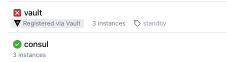
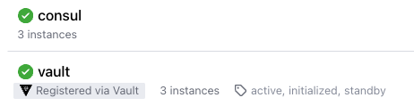

# Production-ready HA setup of Vault with Consul storage backend installed by helmfile 

This setup allows to install a Vault cluster and a Consul cluster in Kubernetes. In addition, the entire setup has been secured End-to-End TLS according to [HashCorp recommendations](https://developer.hashicorp.com/vault/tutorials/operations/production-hardening).
In order to simplify installation as much as possible (to single CLI command), the helmfile was used.


## Prerequisites
To install entire stack using helmfile, the following tools must be installed locally:

- helm
- [helmfile](https://github.com/helmfile/helmfile)
- [cfssl & cfssljson](https://github.com/cloudflare/cfssl) - to generate TLS certs
- [Consul CLI](https://developer.hashicorp.com/consul/downloads) - to generate gossip encryption key

## Installation


```bash
# exec in main directory
helmfile apply -i

# observe the installation process
watch -n 2 kubectl get pods
```

After few minutes you should see below status of pods

```bash

NAME                     READY   STATUS    RESTARTS
consul-consul-server-0   1/1     Running   0       
consul-consul-server-1   1/1     Running   0       
consul-consul-server-2   1/1     Running   0       
vault-0                  0/1     Running   0       
vault-1                  0/1     Running   0       
vault-2                  0/1     Running   0       
```

```bash
# establish tunnel to consul server
kubectl -n vault port-forward svc/consul-consul-server 8501:8501

# open Consul UI in browser
chrome https://localhost:8501/ui/dc1/services
```


To unseal Vault follow belows:

```bash
# initialize Vault
kubectl exec vault-0 -- vault operator init \                                        
    -key-shares=1 \ 
    -key-threshold=1 \
    -format=json > vault-keys.json  
    
    
# unseal all Vault instances with 'unseal_keys_b64'
kubectl exec vault-0 -- vault operator unseal wNbJsBwaUqTeXt/JstNeCp5zRy5+p7um5Ft0sydiLgs=
kubectl exec vault-1 -- vault operator unseal wNbJsBwaUqTeXt/JstNeCp5zRy5+p7um5Ft0sydiLgs=
kubectl exec vault-2 -- vault operator unseal wNbJsBwaUqTeXt/JstNeCp5zRy5+p7um5Ft0sydiLgs=
```

From now Vault pods should be health and status in Consul UI should be active

```bash

NAME                     READY   STATUS    RESTARTS
consul-consul-server-0   1/1     Running   0       
consul-consul-server-1   1/1     Running   0       
consul-consul-server-2   1/1     Running   0       
vault-0                  1/1     Running   0       
vault-1                  1/1     Running   0       
vault-2                  1/1     Running   0       
```



## Cleanup

```bash
# exec in main directory
helmfile destroy -i
```
